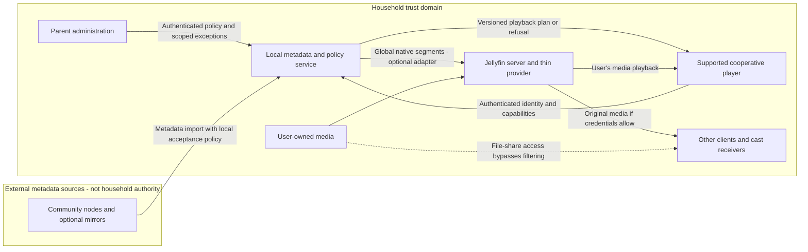

# Playback feasibility

> Recovered original study. Later corrections and qualifications are recorded in [the reviewed proposal](04-architecture-proposal.md) and [independent review](06-independent-review.md). Source-level findings are not runtime validation.

Original delivery status: `complete`. The original report prose is preserved below, including its delivery limitations.

## Original summary

Research complete; no implementation or live-server work performed. The metadata ecosystem remains feasible, but the current architecture does not establish dependable filtering, and a response-filtering proxy cannot provide unbypassable household enforcement. The strongest new findings are pinned-source evidence that Jellyfin Web 10.11.11 gives Unknown segments no default action, suppresses certain short or replayed skips, and that an API outage during provider refresh can delete previously stored Cleanyfin segments. Jellyfin does ship remote mute/unmute commands; these are not automatic segment-mute support. Kodi-style action-code EDL must not be conflated with mpv's different EDL format.

Recommend a metadata-first core with one explicitly tested, cooperative playback adapter, an honest unsupported-state contract, and parent-authorized policy exceptions. Treat native Unknown delivery as experimental until a live compatibility gate passes. A dedicated cooperative player can implement richer policy and mute without waiting for an upstream segment action, but adds client maintenance and remains bypassable wherever the viewer can access unfiltered media. Tamper-resistant filtering is a separate product decision requiring comprehensive media-access controls, not a metadata-proxy feature.

The substantive report, trust-boundary Mermaid diagram, alternatives, and five proposed experiments are returned below. The requested Markdown report was not created because the higher-priority worker instruction explicitly prohibits writing report/summary Markdown files. All repository files were preserved, including the pre-existing cleanyfin.portagenty.toml change.

## Owner decision and strategy
PROPOSED: Decide whether the first product promises cooperative filtering on trusted household devices or resistance to a viewer deliberately bypassing it. These are different products. The first can preserve free/self-hostable deployment, local authority and low operational burden; the second requires control over credentials, alternate clients, downloads, direct server routes and file shares, and cannot be delivered by selecting timestamp responses.

REJECTED: The assertion that a metadata response proxy makes unmodified clients obey. The earlier report explicitly claims this at knowledge-base/01-working/spike-a-enforcement.md:93-103. Selecting instructions does not force their execution. Preserve the metadata core and reversible adapters; reopen the enforcement gate rather than treating the earlier source spike as runtime proof. The live golden-path criterion remains unmet in the evidence inspected: docs/src/content/docs/project/roadmap.md:53-61.

## IMPLEMENTED versus aspirational
IMPLEMENTED: The provider queries one fingerprint, converts every returned interval into Type=Unknown, discards category/action in its output, and catches errors by returning no segments: plugin/CleanyfinSegmentProvider.cs:48-92. Consequently, mute and mark submissions become the same native segment representation as skip; actual playback depends on client behavior, not the submitted action.

IMPLEMENTED: The API accepts mute/skip/mark and serves fingerprint-based metadata, but its route table contains no household policy or bypass endpoints: server/internal/api/api.go:27-47. Newly submitted rows are pending, yet the playback query includes every non-hidden row above the vote threshold: server/internal/store/store.go:139-161. A moderation queue is not presently a published-only playback gate.

IMPLEMENTED: The marking PWA selects the first returned playing session and polls every second, without binding its marks to a deliberately selected player: pwa/src/main.ts:50-99. This is not a precise playback-control loop. The write controller forwards metadata but does not invoke segment materialization or refresh: plugin/SegmentsController.cs:45-99. Its 'live-insert' comment is not proof of immediate native playback updates.

## SOURCE-VERIFIED upstream contract
Pinned baseline is Jellyfin server and Web v10.11.11, matching plugin/Jellyfin.Plugin.Cleanyfin.csproj:4-16; this is not an assertion about every latest client. Sources accessed 2026-10-08 for the research folder dated 2026-10-07.

[S1–S3] Generation receives ItemId and ExistingSegments, not viewer/session context. MediaSegmentDto contains Id, ItemId, Type, StartTicks and EndTicks, not per-segment Action, category, severity or policy. The core controller inspected exposes authenticated GET with a user-scoped item lookup and optional type filtering; it contains no core POST/DELETE handlers. Internal manager creation/deletion methods are not evidence of shipped HTTP write endpoints.

[S4] SessionController does ship playstate commands with seekPositionTicks, general commands, and capability-reporting endpoints. [S5] GeneralCommandType includes Mute, Unmute and ToggleMute. Therefore 'session APIs can only stop/message' and 'there is no muting API anywhere' are overbroad. Automatic segment mute is absent from the inspected Web action implementation; remotely telling a cooperating device to mute is a different capability, with delivery, timing and restoration problems.

## SOURCE-VERIFIED native-client barriers
[S6–S7] Web v10.11.11 defaults Intro/Outro to AskToSkip and every other type, including Unknown, to None. The manager requests only types whose actions are enabled. Its Unknown path cannot be presumed functional with ordinary defaults; whether supported UI exposes a usable Unknown configuration still needs live verification.

The same manager suppresses automatic skipping for intervals shorter than one second when StartTicks is nonzero, suppresses prompts shorter than three seconds under the analogous condition, and can deliberately ignore a segment after seeking back into it. It waits for playback time updates and an in-segment match rather than establishing a sample-accurate exclusion boundary. These are convenience-player semantics, not a content-access guarantee. A proxy cannot repair them by keeping/dropping timestamps.

The inspected start path also depends on MediaSource.HasSegments and fetches using MediaSource.Id. Verify multiple media versions, alternate sources and profile switches rather than assuming the provider's item.Path always describes the selected playback source. Do not broaden this pinned Web finding into a current Roku/Android/Apple support matrix without separate evidence.

## SOURCE-VERIFIED degradation and coupling
[S8] On ordinary refresh, Jellyfin compares returned segments with ExistingSegments and deletes the old provider rows before replacing changed output. Cleanyfin catches an API failure and returns an empty list; therefore an outage during a refresh of an item with existing Cleanyfin rows can remove those rows. This follows the two source paths; it was not reproduced on a live server. Force-overwrite is more severe: the manager deletes all item segments before invoking providers.

PROPOSED: Distinguish valid-empty metadata from unavailable metadata. Use a validated, bounded last-known-good snapshot only under an explicit freshness policy; surface staleness to the viewer. Test refresh behavior before choosing a preservation mechanism—ordinary preservation alone will not undo force-overwrite deletion. Disabled/missing providers can also make stored segments unavailable through provider filtering.

Pin server, plugin and client versions as a tested tuple. net9.0 plus Jellyfin.Controller 10.11.11 does not promise 10.10 compatibility or future binary compatibility. Upgrade testing must cover assembly loading, generation, HasSegments, action behavior and failure semantics. Keep the last tested deployment snapshot; do not assume arbitrary server/database downgrades are safe.

## Identity, profile and bypass boundaries
IMPLEMENTED: Moviehash uses file length plus first/last 64 KiB, and fallback is jf:itemId: plugin/Moviehash.cs:22-66. Duration is stored but is not part of the provider query or the SQL lookup predicate. That does not implement the documented fingerprint-plus-duration confidence gate. A file-property match is not proof of edition/timeline equivalence; exact identifiers permit linkage, and hash-prefix queries do not guarantee anonymity.

SOURCE-VERIFIED locally: Both custom controllers are authenticated but call non-user-scoped GetItemById: plugin/FingerprintController.cs:15-43 and plugin/SegmentsController.cs:20-55. Unlike upstream's explicit user-scoped lookup, these methods do not themselves establish per-item authorization. Treat unauthorized-item access as an experiment to verify, not a demonstrated exploit.

PROPOSED: Bind policy to the authenticated household identity and selected media source, not a caller-supplied profile name. Exceptions need parent authorization, exact item/edition and profile scope, expiry, revocation, and an audit trail. Public anonymous contributions must remain separate from administrative authority. Same-LAN location, CORS, device names and self-reported capabilities are not authorization. An allowed original-file credential or SMB/NFS path defeats a filtered-player boundary.

## Architecture options: complexity and reversibility
1. PROPOSED cooperative native provider: lowest operational burden, easiest uninstall and best upstream alignment. Keep as an experimental adapter until Unknown behavior is demonstrated. Global generation cannot itself resolve different household profiles; arbitrary native mute and noncooperating-client protection are unsupported.
2. PROPOSED single-purpose cooperative player/adapter: moderate-to-high development burden but little extra server operation if shipped with the local app. Can own preflight, category policy, precise seek/mute scheduling, profile switching and visible failure states. Avoid a full Jellyfin fork; start with one declared platform. Strongest route to a controlled skip-plus-mute experience, but not tamper resistance. Metadata remains reusable if the client is replaced.
3. PROPOSED session-command companion: low prototype cost, medium continuing reliability burden. Commands ship, but scheduling depends on reported positions, transport delay, device support, seeks and manual volume changes. Useful for a convenience experiment, not word-level guarantees. Easy to disable; never use ToggleMute as an assumed idempotent state setter.
4. PROPOSED metadata response proxy: medium operational complexity—authentication, TLS, caching and another routing dependency—for per-user selection only. It must also map native intervals back to richer policy metadata, which the DTO lacks. Reversible by removing the hop. REJECTED as enforcement.
5. PROPOSED local media transform/transcode: highest operational cost and coupling—CPU/GPU, codec/subtitle compatibility, seeking, manifests, output caches and every alternate access route. It could remove or silence media before delivery, but no shipped native segment hook establishes this. A generic reverse proxy alone cannot transform interval content. REJECTED for the current metadata-only v1 boundary, not declared categorically unlawful or impossible.
6. PROPOSED export adapters: low core coupling, moderate per-player verification cost. Good for local/offline use and reversibility, poor for centrally revocable policy once exported.

## Playback modes and exports
Direct Play sends unchanged media; remux changes container without altering streams; Jellyfin's documented Direct Stream can transcode audio while preserving video; video transcoding is another mode [S12, indexed official documentation]. None automatically applies Cleanyfin policy. Cooperative client actions can theoretically operate across them, but seek latency, timestamp mapping and player/audio backends need separate tests. Audio transformation might preserve original video; scene removal has harder keyframe/timeline implications. Treat these as design possibilities, not established compatibility.

Casting transfers playback responsibility to a receiver. Sender-side mute/seek logic is insufficient unless that exact receiver participates. Downloads/offline playback require an explicit plan and compatible player; downloading the original through another client remains a bypass. Generic external players, file shares and untested cast receivers are unsupported for strict filtering.

[S9] mpv v0.40.0 documents its own '# mpv EDL v0' range-concatenation format, not a demonstrated Kodi/MPlayer action-code mute contract. [S10] indexed Kodi documentation identifies action 1 as mute; direct retrieval was 403, so platform/version behavior remains unverified. Do not promise one EDL works everywhere. Generate metadata exports without requiring the old Jellyfin EDL plugin or compulsory library writes; sidecar placement is an optional user-managed integration. Version and document lossy conversions, profile scope and original-versus-edited timeline semantics.

## PROPOSED smallest viable compatibility contract
Support one exact server/plugin/client tuple, one explicitly identified file/source with validated duration, and cooperative playback only. Native Unknown delivery stays experimental until its gate passes. If true mute is required for first release, select one purpose-built adapter instead of waiting indefinitely for native segment actions.

A playback plan should bind user/profile, item/source, timeline identity, policy revision, metadata revision, capabilities and expiry. Required action support, seekability, mute-state restoration, playback mode and online/offline status must be negotiated. Jellyfin's generic SupportedCommands is useful evidence but neither an automatic-filtering protocol nor trusted attestation.

Show separate states for Filtered, No matching metadata, Unsupported action/client, Uncertain edition, Stale plan and Unfiltered by explicit approval. Empty results do not mean 'safe.' Never silently convert mute or mark into skip. When an action is unavailable, offer an explicitly approved fallback or refuse the filtered session.

Fail-open means an authorized viewer deliberately accepts unfiltered playback with a persistent warning. Fail-closed means the supported player refuses/pauses until a valid plan exists. That player-level refusal does not block other Jellyfin clients. Claim household-wide denial only after every relevant media route is demonstrably controlled; whole-item ACLs can complement but do not create sub-scene enforcement.

## PROPOSED deployment/trust boundary diagram

Only metadata crosses the community boundary. The plugin runs inside Jellyfin's privileged process; the local policy service should not require a writable media mount. Other authorized playback paths are deliberately visible as bypasses rather than hidden by the diagram. A transform gateway would be a separate optional architecture, not a relabeling of this one.

## Five bounded, falsifiable experiments — PROPOSED, not executed
E1: Native adapter gate. Use isolated server/Web 10.11.11, two test users and one synthetic fixture. Test Unknown against Intro/Commercial controls, four durations (0.2/0.7/1.5/4 seconds), defaults versus configured actions, and seek-back/resume. Record requested types and rendered playback. Pass only for the exact advertised behavior; omitted Unknown or suppressed intended actions fails that claim. Rollback: remove fixture metadata and restore client settings/provider configuration.

E2: Cooperative action gate. One candidate player, synthetic audio/video markers, and three playback modes: direct play, direct stream and transcode. Exercise skip, mute, seek into an interval, resume, speed change and an already-muted user state. Predeclare the timing tolerance and measurement method; a strict no-exposure claim requires no prohibited output in the measured cases, not merely eventual seeking. Incorrect restoration or any unsupported silent fallback fails. Rollback: disable the adapter and return to an explicitly unfiltered test player.

E3: Authorization/bypass gate. Two child profiles and one parent; attempt wrong-profile selection, unauthorized item lookup, expired/revoked exception, direct Jellyfin port, original download and one cast receiver. Pass scoped authorization only when forbidden requests are denied and switching profiles invalidates stale plans. Any original-media path defeats a household-wide enforcement claim. Rollback: revoke test credentials and restore isolated access settings.

E4: Failure/upgrade gate. One pre-seeded item; simulate API timeout, legitimate empty response, malformed intervals and provider refresh with/without force-overwrite. Then test one proposed server/plugin upgrade pair. Pass when outcomes match declared freshness/failure policy, old protections are not silently cleared, and unsupported versions are visible. Rollback: restore the isolated server/data snapshot and tested package tuple.

E5: Export gate. One fixture with skip/mute/overlap intervals, one explicitly pinned Kodi build and mpv 0.40.0 using separate documented adapters. Verify action semantics, units, offset, changed duration and offline playback. Any advertised action that is ignored or applied on the wrong timeline fails; decline unsupported export rather than substitute silently. Rollback: remove test sidecars/playlists and retain canonical metadata.

Cross-cutting policy tests: interval union/precedence, checked tick conversion, zero/negative/out-of-range spans, exact-duration mismatch, selected-source changes, per-title exception expiry, profile cache isolation, overlapping mute restoration, revision invalidation and pending-versus-approved metadata.

## Sources and evidence scope
All sources below accessed 2026-10-08. Pinned source inspection is not a live compatibility test. Ten primary fetches succeeded; two failed. Four searches and fifteen selected repository files stayed within the assigned bounds.

Sources:
- [S1: Jellyfin v10.11.11 MediaSegmentsController](https://raw.githubusercontent.com/jellyfin/jellyfin/v10.11.11/Jellyfin.Api/Controllers/MediaSegmentsController.cs)
- [S2: MediaSegmentDto](https://raw.githubusercontent.com/jellyfin/jellyfin/v10.11.11/MediaBrowser.Model/MediaSegments/MediaSegmentDto.cs)
- [S3: MediaSegmentGenerationRequest](https://raw.githubusercontent.com/jellyfin/jellyfin/v10.11.11/MediaBrowser.Model/MediaSegments/MediaSegmentGenerationRequest.cs)
- [S4: SessionController](https://raw.githubusercontent.com/jellyfin/jellyfin/v10.11.11/Jellyfin.Api/Controllers/SessionController.cs), especially lines 153–267 and 335–390
- [S5: GeneralCommandType](https://raw.githubusercontent.com/jellyfin/jellyfin/v10.11.11/MediaBrowser.Model/Session/GeneralCommandType.cs), lines 27–32
- [S6: Web v10.11.11 mediaSegmentManager](https://raw.githubusercontent.com/jellyfin/jellyfin-web/v10.11.11/src/apps/stable/features/playback/utils/mediaSegmentManager.ts), lines 38–116
- [S7: Web mediaSegmentSettings](https://raw.githubusercontent.com/jellyfin/jellyfin-web/v10.11.11/src/apps/stable/features/playback/utils/mediaSegmentSettings.ts), lines 8–19
- [S8: MediaSegmentManager](https://raw.githubusercontent.com/jellyfin/jellyfin/v10.11.11/Jellyfin.Server.Implementations/MediaSegments/MediaSegmentManager.cs), lines 76–138 and 193–231
- [S9: mpv v0.40.0 EDL specification](https://raw.githubusercontent.com/mpv-player/mpv/v0.40.0/DOCS/edl-mpv.rst)
- [S10: Kodi EDL documentation](https://kodi.wiki/view/Edit_decision_list), indexed official excerpt only; direct fetch returned 403
- [S11: Jellyfin media-segment documentation](https://jellyfin.org/docs/general/server/metadata/media-segments/), indexed official excerpt confirming client-chosen actions; a different attempted docs path returned 404
- [S12: Jellyfin transcoding documentation](https://jellyfin.org/docs/general/post-install/transcoding/), indexed official excerpt only
- [Web v10.11.11 source-tree lookup](https://api.github.com/repos/jellyfin/jellyfin-web/git/trees/v10.11.11?recursive=1), returned tree SHA 35c0793ece3adbd247eab290ae1effab851f3d37. No unavailable source was bypassed.

## Original unresolved questions and limitations

- The requested report destination knowledge-base/01-working/long-term-architecture-2026-10-07/01-playback-feasibility.md was not written because a higher-priority instruction prohibits report/summary Markdown files. Findings are returned inline for parent synthesis.
- Owner values decision: cooperative convenience on supported devices versus deliberately bypass-resistant household enforcement. Do not imply the latter follows from a metadata proxy.
- Owner scope decision: retain a strict metadata-only distribution boundary, or separately evaluate an optional local media-transform product. Metadata-only distribution, CC0 data and AGPL code do not establish legal clearance for every local playback/transcoding workflow; jurisdiction-specific legal review is required.
- No live test establishes Unknown configuration, selected media-source mapping, marker accuracy, client cache isolation, authorization behavior, segment refresh recovery, casting/download compatibility or exact skip/mute timing.
- Only pinned Jellyfin/Web v10.11.11 behavior was directly inspected. Current Android TV, Roku, Kodi, Swiftfin and other client support—including any newer mute functionality—remains unverified in this worker's bounded evidence.
- Kodi's full primary documentation was unavailable with HTTP 403; EDL details beyond the indexed official excerpt need verification against a selected player version. mpv interoperability requires its own adapter and tests.
- Policy freshness limits, acceptable exposure/timing tolerance, exception authority, stale-plan behavior and permission to play unfiltered are owner-controlled choices, not decisions this research made.

## Original checks

- Inspected git status before research and at completion. Both showed only the pre-existing modification to cleanyfin.portagenty.toml; final diff stat remained one insertion and one deletion in that file.
- Read 15 selected repository files; performed 4 web searches and 12 primary source/page fetch attempts, with 10 successful and 2 unavailable. No dependency installation, services, containers, browser automation, commits, pushes or publication.
- Cross-checked local provider error-to-empty behavior against pinned upstream replacement/deletion semantics; this is a source-level finding, not an executed failure test.
- Cross-checked local Unknown emission against pinned Web default action selection, enabled-type requests, short-interval suppression and seek-back behavior.
- Verified shipped session-command route signatures and mute/unmute enum members from pinned upstream source, separating remote commands from automatic segment policy.
- Checkpointed discovery, source findings and final handoff in locally retained verification records.
- No builds, tests, timing benchmarks or live feasibility experiments were run; no runtime success or resilience guarantee is claimed.
